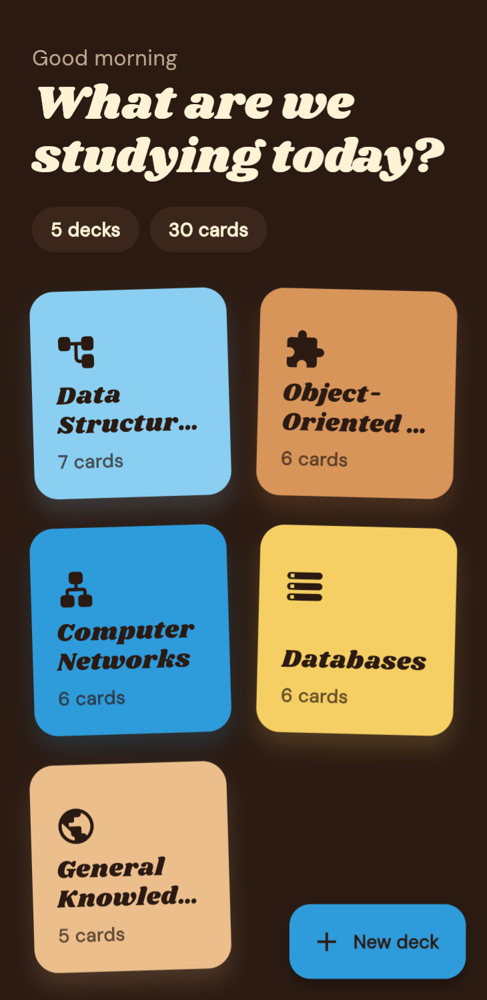
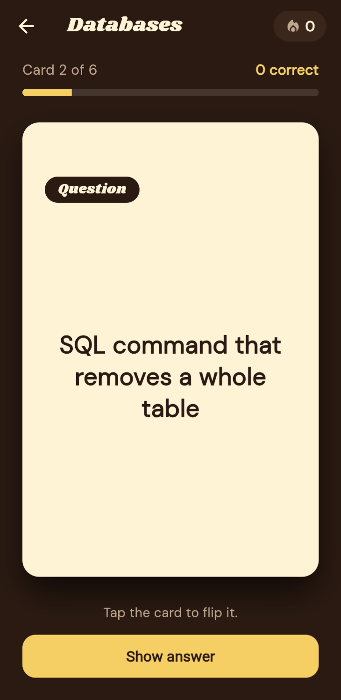
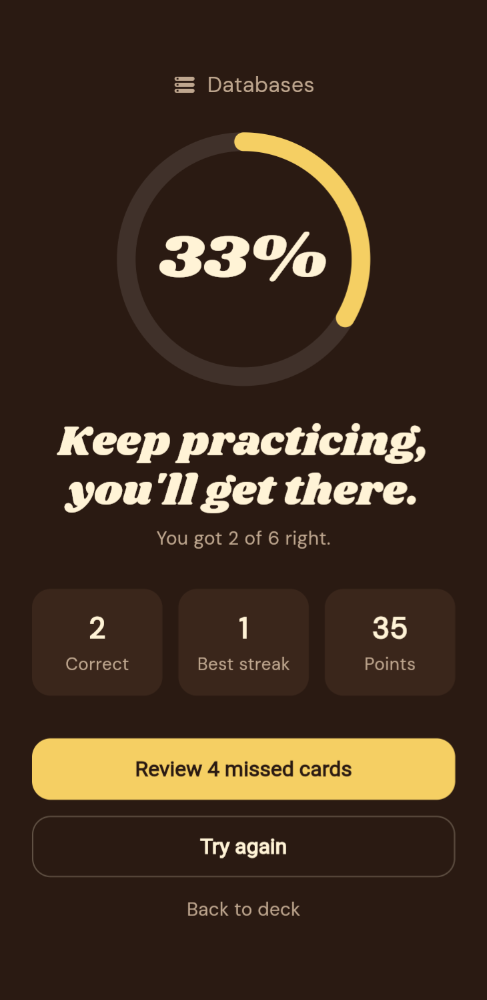
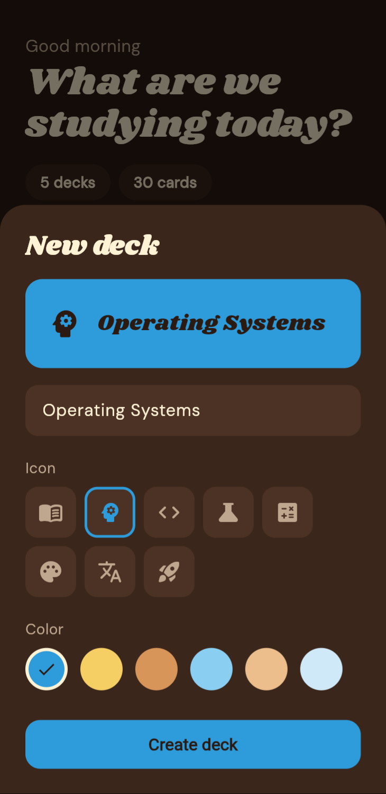
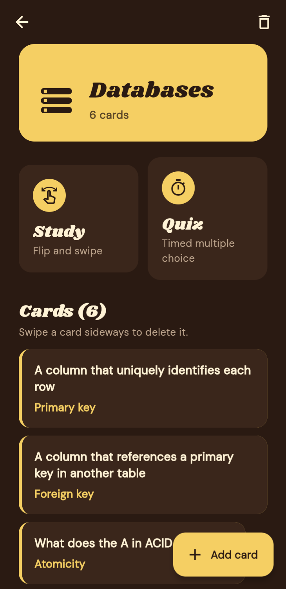
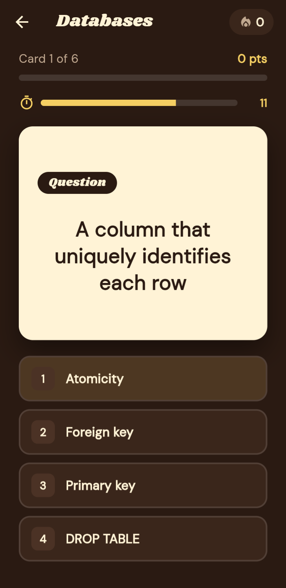
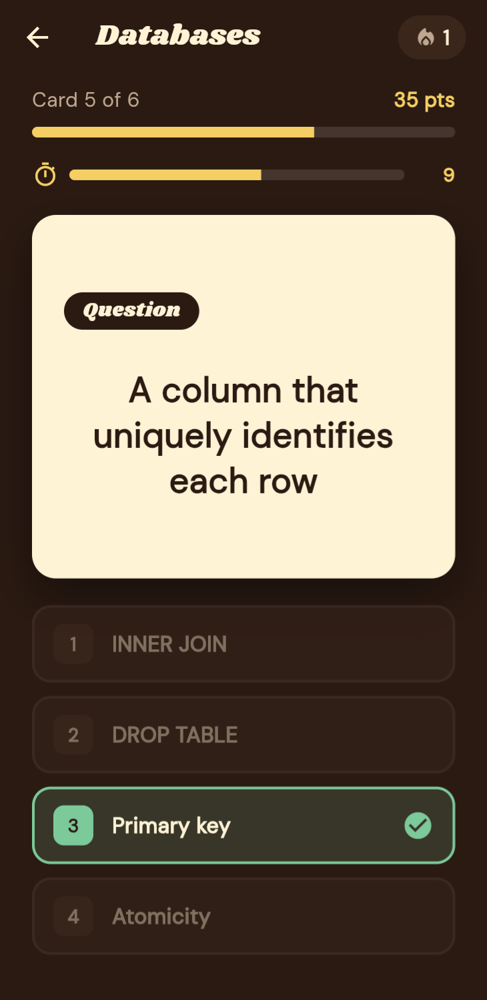
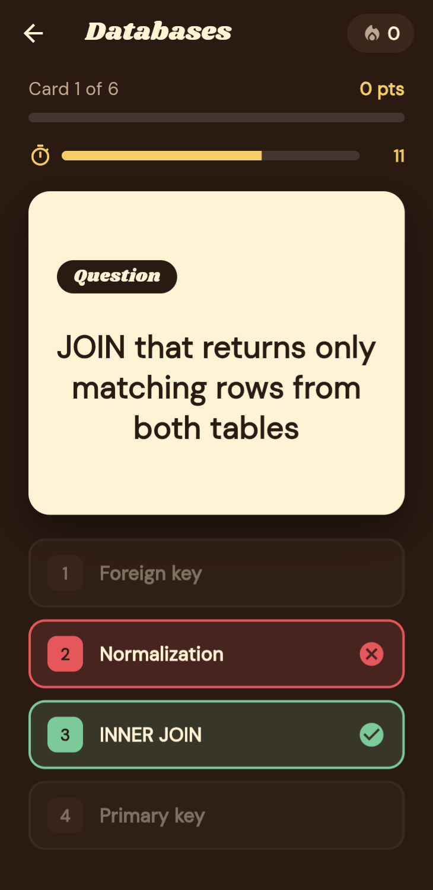
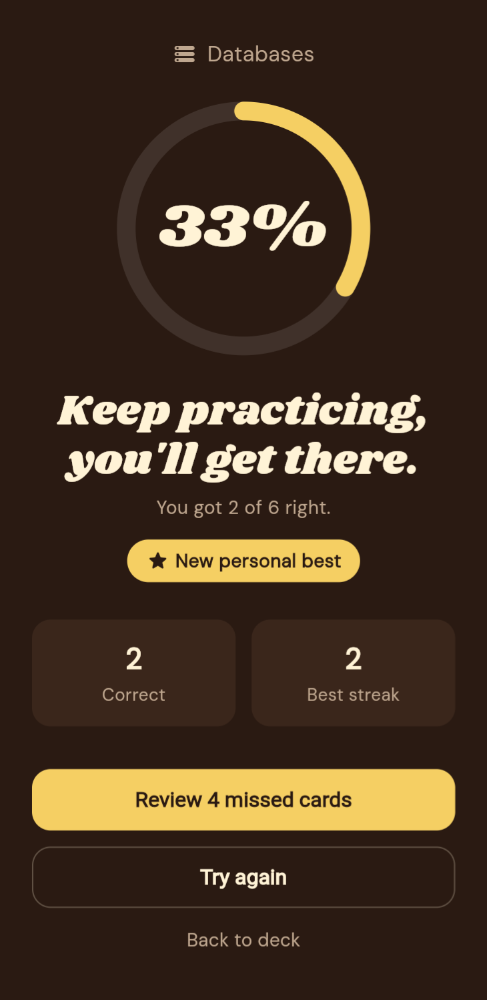

# Flashcard Quiz

A retro, cinema-inspired flashcard and quiz app built with Flutter. Create your own decks, study with swipeable flip cards, or test yourself in a timed multiple-choice quiz.

<p align="center">
  
  
  
</p>

## Features

- **Custom decks.** Create decks with a name, icon and color, then add, delete and undo cards.
- **Study mode.** Cards flip in 3D. Swipe right if you knew it, left if you didn't, with a streak counter.
- **Quiz mode.** A 15-second timer per question, auto-generated multiple-choice options, bonus points for speed and streaks, and a shake animation on wrong answers.
- **Results.** An animated score ring, confetti on high scores, personal best tracking, and a "review missed cards" option.
- **Keyboard shortcuts on web and desktop.** Space to flip, ← / → to swipe, 1–4 to answer.

## Screenshots

| Create a deck | Deck page | Quiz |
|:---:|:---:|:---:|
|  |  |  |
| **Correct answer** | **Wrong answer** | **Study results** |
|  |  |  |

More screenshots are in the [`screenshots`](screenshots) folder.

## Design

- **Colors:** chocolate `#2A1A12`, popcorn `#FFF3D6` and cerulean `#2E9BDB`, with butter, caramel and sky tones for decks.
- **Type:** [Shrikhand](https://fonts.google.com/specimen/Shrikhand) for headlines and [DM Sans](https://fonts.google.com/specimen/DM+Sans) for body text.
- **Cards:** styled like a striped popcorn box.

## Built with

- Flutter and Dart
- `ChangeNotifier` + `ListenableBuilder` for state management
- `CustomPainter` for the confetti and score ring
- Custom gesture handling and implicit/explicit animations for the swipe, flip and shake effects
- [google_fonts](https://pub.dev/packages/google_fonts) for typography

## Project structure

```
lib/
├── main.dart
├── models/        Deck and Flashcard classes
├── data/          Sample decks and app state (ChangeNotifier)
├── theme/         Colors, fonts and button styles
├── widgets/       Reusable UI: flip card, popcorn card, confetti, score ring
└── screens/       Home, deck, study, quiz and results screens
```

## Run it

```bash
flutter pub get
flutter run -d chrome
```

## What I learned

<!-- Replace this comment with 2–3 sentences in your own words.
     For example: what was hardest to build, what you'd do differently,
     or what you learned about Flutter animations or state management. -->

## Roadmap

- Save decks on the device (shared_preferences or Hive)
- Import decks from CSV
- Spaced repetition scheduling
